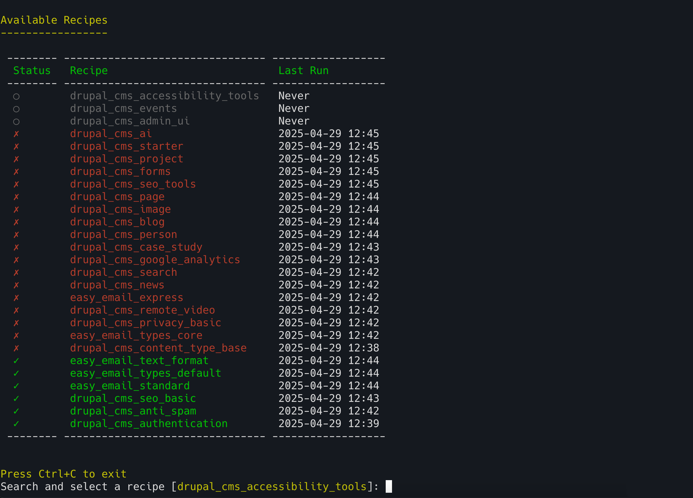

# Drupal Recipe Manager

A CLI tool for managing and executing Drupal recipes.



## Features

- Interactive recipe selection and execution
- Recipe status tracking (success/failure/not executed)
- Custom command configuration
- Variable transformations
- Command execution logging
- Beautiful terminal UI with color-coded status indicators

## Requirements

- PHP 8.2 or higher
- Composer
- Drupal installation with recipes

## Installation

1. Install using Composer:

```bash
composer require --dev d34dman/drupal-recipe-manager
```

2. Create a configuration file in your Drupal project root:

An example file for a ddev based project is as follows.

```yaml
# drupal-recipe-manager.yaml
# Directories to scan for recipes
scanDirs:
  - recipes
# Custom commands for recipe management
commands:
  ddevRecipe:
    description: "🚀 Run Drush recipe command using ddev"
    command: "ddev drush recipe ../${folder}"
    requiresFolder: true
logsDir: recipes/logs
```

## Usage

### Interactive Mode

```bash
vendor/bin/drupal-recipe-manager recipe
```

### List Available Recipes

```bash
vendor/bin/drupal-recipe-manager recipe --list
```

### Run a Specific Recipe

```bash
vendor/bin/drupal-recipe-manager recipe [recipe-name]
```

## Configuration

### Directories

- `scanDirs`: List of directories to scan for recipes
- `logsDir`: Directory for storing logs (relative to scripts directory)

### Commands

Define custom commands in the configuration file:

```yaml
commands:
  drush:
    description: "Run Drush recipe command"
    command: "ddev drush recipe ${folder_basename}"
```

### Variables

Define variable transformations:

```yaml
variables:
  - name: "folder_relative"
    input: "${folder}"
    search: "^.*?recipes/"
    replace: ""
```

## Status Indicators

- ✓ Green: Successfully executed
- ✗ Red: Failed execution
- ○ Gray: Not executed yet

## License

MIT License - See LICENSE file for details.

## Contributing

1. Fork the repository
2. Create a feature branch
3. Commit your changes
4. Push to the branch
5. Create a Pull Request

## Author

D34dman (shibinkidd@gmail.com) 